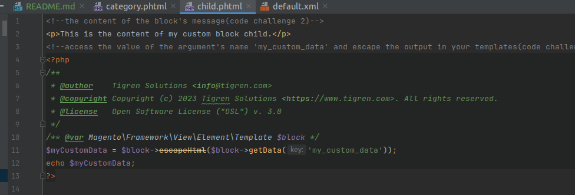
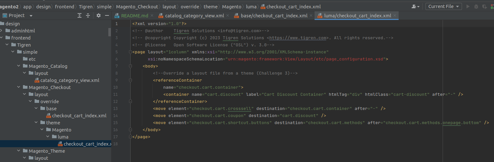
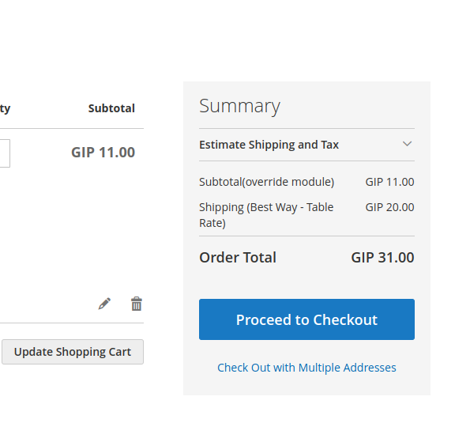

# Code challenge 1:

● Add a container to the footer on all pages:

## Images:

● Add a block to the container that outputs a message:

## Images:

● Move the message on category pages to the header

## Images:

# Code challenge 2:

● Add a child block to one of your previously created blocks and output further content from another template

## Images:

● Use arguments to pass and output data to the new child block

## Images:

● Escape the output in your templates

## Images:

# Code challenge 3:

● Override a layout file:

○ From a theme

## Images:

○ From a module

## Images:

# Bonus challenge:

● How can you add a block to multiple pages (but not all) without duplicating the layout instructions?

If you want to add a block to multiple pages without duplicating the layout instructions, you can create a custom widget
for the block and add the widget to each page where you want the block to appear.
Here are the steps to create a custom widget:

● In the Magento Admin Panel, go to Content > Widgets and click "Add Widget".

● Choose the widget type "CMS Static Block" and click "Continue".

● Fill in the widget information, including the Widget Title, Assign to Store Views, and Layout Updates.

● In the "Widget Options" section, select the static block that you want to add to the widget and configure any other
options as needed.

● Save the widget and repeat the process for any additional pages where you want to add the block.
